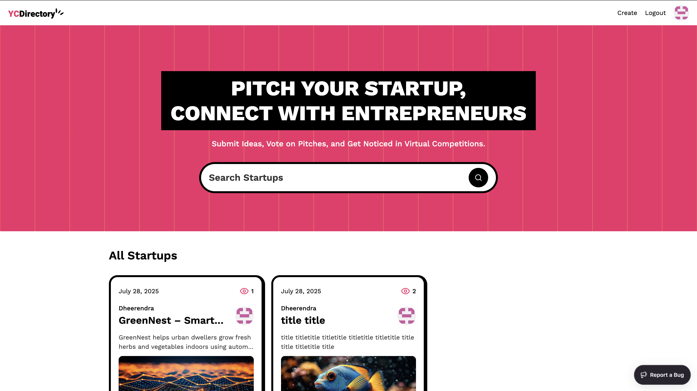

# 🚀 YC-directory

**YC-directory** is a modern blogging platform built with **Next.js**, where users can create and publish insightful articles about their startup journey. Inspired by the spirit of innovation, it’s a directory of stories from startup founders, makers, and enthusiasts.

### 🏠 Home Page  

---

---

## ✨ Features

- **GitHub Authentication** using OAuth
- Users can:
  - **Login with GitHub**
  - **Create**, **edit**, and **publish** articles
  - View articles posted by others
- Homepage with a feed of published articles
- SEO-friendly, fast, and clean UI
- Built with **Next.js** and modern frontend standards

---

## 🛠️ Tech Stack

- **Frontend/Framework**: Next.js (React)
- **Authentication**: GitHub OAuth
- **Backend/Database**: Sanity 
- **Styling**: Tailwind CSS
- **Deployment**: Vercel

---

## 🌐 Live Demo

- 🔗 [https://yc-directory-silk-theta.app](https://yc-directory-silk-theta.vercel.app/)

---

## 🙏 Thanks to

- JavaScript-Mastery => https://youtu.be/Zq5fmkH0T78?si=hsSPO0im2sHulLQh
  
